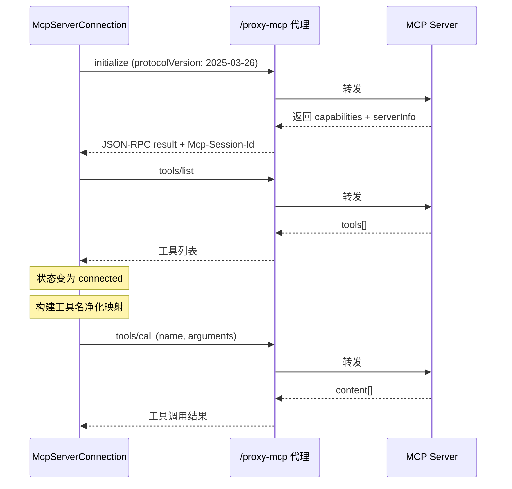

> **脱敏说明**：本文件是原项目内部总结文档的脱敏副本，作为 MVP 的设计依据入库。正文逐字保留，仅做两类替换，且本说明不列出被替换的原文：
>
> - **公司名 / 第三方平台名** → `{内部 AI 中台}`、`{企业 IM}` 占位符（第四章「四类工具」中 mcp 工具一处）
> - **内部产品代号**（文件类型命名）→ `VfsFile`，与 SDD 的实现命名对齐（第二章两处）
> - **删除两段面试私人材料** —— 原第一章末的「面试 2 分钟版叙事」口述稿、原第十三章「简历产出」。二者非设计内容，删除后原十四、十五章顺延为十三、十四章。
>
> 技术密度一律不动：组件名、文件路径、端口号、协议细节、参数取值均按原文保留。

## 慧应用项目全景总结

### 一、项目定位与全景总览

AI 应用生成平台，用户通过自然语言描述需求，智能体在浏览器虚拟工作区中生成前端页面代码，实时预览渲染，支持多轮迭代编辑与工具扩展。

**端到端主流程：**

```
【输入层】 ChatInterface
   ├─ 文字
   ├─ 图片 ── compressImage: canvas 压 800px / JPEG 0.7 / ≤3张 → dataURL
   └─ 语音 ── useVoiceInput: WS 双向流, 服务端 VAD 断句 → 文字入输入框
        │ onSendMessage(text, images)
        ▼
【Agent 主循环】 runAgentLoop（上限 200 轮）
   │
   ├─ 预处理: 软压缩（>60k token 触发 LLM 摘要，仅 build 模式）
   │
   ├─ ① 组装上下文
   │     systemPrompt + appId + workspace 摘要（只注入文件清单，内容按需 read）
   │     + 硬截断（150k 预算：锚定首条消息 + 倒序贪心保留 + tool 配对保护）
   │
   ├─ ② 调 LLM ── providerRouter（3 次重试 / 5s 间隔）
   │     └─ Claude: SSE 流解析（buffer 分帧 → delta 累积 →
   │                partial_json 拼接 → 按 index 聚合）
   │          → { text, toolCalls }
   │     ├─ toolCalls 为空 ──→ return ★ 模型自主终止，整个循环结束
   │     ▼ 非空
   ├─ ③④ 工具执行 executeToolCalls（工具集动态装配：
   │     plan/build 分级、appId 挂 BaaS、MCP 运行时注入）
   │     ├─ fs 工具   → 内存 workspace（edit 五级校验链）
   │     ├─ use_skill → SkillRegistry 指令包 lazy-load
   │     ├─ mcp 工具  → 浏览器直连 JSON-RPC（跨域走代理）
   │     └─ baas 工具 → BaaS API
   │     回填: assistant(tool_use) + user(tool_result) 两条消息
   │        ▼
   └──── 回到 ①
        │ 循环终止后
        ▼
【输出层】 workspaceStore(Zustand) → FileExplorer / CodeViewer / PreviewArea
           AgentProgress 流式外发   → 进度面板（四阶段实时可见）
```

**一次完整旅程（用户发一张截图 + "照这个做个页面"）：**

1. **输入**：截图在 UI 层压到 800px JPEG，语音（如果有）已被 ASR 转成文字，一起进消息列表
2. **第一轮**：模型看到 workspace 文件清单 + 图片 → 输出方案文本 + write_file 调用 → workspace 写入 index.html —— tool_result 回填
3. **第二轮**：模型 read 自己写的文件 → 发现要改 → edit_file（校验链放行）→ 回填
4. **第 N 轮**：模型不再调工具，只输出总结文本 → 循环在②终止
5. **收尾**：workspace 已是最终态，UI 文件树/预览刷新，全程进度面板同步

---

### 二、数据结构层

**Workspace**

- `entry`: string — 入口文件路径
- `files`: Record<string, VfsFile> — 文件字典，key 为路径
- `updatedAt`: number — 时间戳

**VfsFile**

- `path`: string — 文件路径
- `content`: string — 纯文本内容
- `mimeType`: string — MIME 类型

---

### 三、工具集

| 工具 | 职责 | 关键设计 |
|------|------|----------|
| normalizePath | 路径规范化 | 反斜杠转正、去重复斜杠、栈处理 `..`（类 LeetCode 71） |
| createEmptyWorkspace | 冷启动 | 自带默认 index.html |
| readFile | 读文件 | 全文 / 按行切片两模式；start 越界兜底 0；limit 截断省 token |
| writeFile | 创建/覆盖 | 字典写入 key-value |
| editFile | 局部精确替换 | oldString→newString；校验链：空→提示 writeFile / 相等→拒绝 / 计数 0→提示重读 / >1→要求唯一；indexOf 计数不用 split 省内存 |
| deleteFile | 删除 | 删 entry 时重选（优先 index.html，否则首个） |
| searchFiles | 搜索 | 路径通配 + 内容正则降级纯文本；类型过滤；命中截断 |
| buildWorkspaceTree | 结构转换 | 扁平字典 → 树形，供文件树渲染 |

---

### 四、执行层

**ToolExecutor**

- 接收 AI 的 tool_call → 路由到具体 tool(args) → 返回结果
- 工具定义：`{ name, description, inputSchema }`，inputSchema 声明参数名、类型、必填

**四类工具**

- **fs 工具** — 内置虚拟文件系统（上述工具集），操作内存 workspace
- **use_skill** — SkillRegistry 指令包 lazy-load
- **mcp 工具** — 外部工具（`{内部 AI 中台}` MCP 广场 + `{企业 IM}` MCP），浏览器直连 JSON-RPC，跨域走代理
- **baas 工具** — BaaS API，按 appId 挂载

**工具集动态装配**

每次调 LLM 时传入的 tools 列表不是固定的，而是按上下文动态组装：

- **plan/build 分级** — plan 模式隐藏写类工具，只暴露读类，强制先规划后执行
- **appId 挂 BaaS** — 根据当前应用的 appId 绑定对应的 BaaS 工具
- **MCP 运行时注入** — 已连接的 MCP Server 在运行时拉取 tool list 注入工具列表

---

### 五、主循环（Run Agent Loop）

**最多 200 轮**，循环开始和结束时检查：用户取消信号、是否返回最终文本、是否达到上限

**四阶段循环：**

1. **构造与调用** — 构造系统提示词（含 workspace 文件清单）+ 截断消息历史（不超过 token 上限）→ 经 providerRouter 调 LLM 获取响应
2. **提取与判断** — 提取 `{ text, toolCalls }`；**toolCalls 为空 → 模型自主终止，整个循环结束**；非空 → 进入工具执行
3. **工具执行** — executeToolCalls 路由到四类工具（fs / use_skill / mcp / baas）
4. **回填** — assistant(tool_use) + user(tool_result) 成对追加到消息队列，回到 ① 开启下一轮

**每轮输入：** 聊天历史、当前工作区、系统提示、模式标识（plan/build）、停止信号

**每轮输出：** AI 最终文本、更新后的工作区、工具执行时间线

**进度上报（emit 事件机制）：**

通过 emit 事件驱动 UI 显示 AI 的思考/操作进度（多轮循环，至少第二轮思考完才结束）：

```
thinking → tool-call → tool-done → thinking → tool-call → tool-done → ... → finished
   ↓emit       ↓emit        ↓emit      ↓emit       ↓emit        ↓emit              ↓emit
"思考中..."  "写入src/app.ts" "完成"   "思考中..."  "读取pkg.json" "完成"         "生成完成"
```

事件类型：
- `thinking` — AI 正在思考
- `tool-call` — 显示正在执行的操作（如"写入 src/app.ts"、"读取 package.json"）
- `tool-done` — 工具执行完成
- `finished` — 整体生成完成

**AgentProgress 数据结构：**

```typescript
AgentProgress {
  steps: AgentProgressStep[]   // 每轮循环快照
  finished: boolean            // 是否全部完成
  startAt: number              // 开始时间
}

AgentProgressStep {
  thinkingText: string         // AI 的思考文本
  toolCalls: AgentToolCallInfo[]  // 该轮调用的工具列表
  status: 'thinking' | 'tool-call' | 'tool-done'
}

AgentToolCallInfo {
  name: string                 // 工具名
  keyArgs: { path, pattern }   // 保留关键参数（如搜索关键字）
  status: 'running' | 'done' | 'error'
}
```

**设计细节：**
- 每轮 emit 到 progress 的是**浅拷贝的新对象**，防止 React useEffect 认为是同一引用而不触发更新
- **累加式数组**，每轮往 steps 追加新快照，不反复 mutate 同一个对象

**为什么这样设计（错误做法对比）：**

错误 1 — 反复 mutate 同一个对象：
```typescript
const step = { status: 'thinking', thinkingText: '' }
step.status = 'tool-call'  // ❌ 引用没变，React 浅比较跳过更新
emit(progress)
```

错误 2 — 新数组但复用同一对象引用：
```typescript
const step = { status: 'thinking', thinkingText: '...' }
emit({ steps: [step] })  // ✅ 首次渲染
step.status = 'tool-call'
emit({ steps: [step] })  // ❌ 数组是新的，但 steps[0] 引用没变，子组件可能不更新
```

正确做法 — 每轮新对象 + 累加式数组：
```typescript
steps = [
  { status: 'thinking', thinkingText: '...' },   // 第1轮快照
  { status: 'tool-call', toolCalls: [...] },      // 第2轮快照
  { status: 'tool-done', toolCalls: [...] },      // 第3轮快照
]
// ✅ 每步都是全新对象，React 正确感知变化，且保留完整执行历史
```

---

### 六、上下文管理（两阶段截断）

**阶段一：语义截断（软压缩）**
- 触发时机：调用 LLM 之前
- 触发条件：对话 token 数 > 60000（提前压缩，避免触及硬上限）
- 模式限制：仅 build 模式触发（plan 模式对话短，不需要）
- 处理流程：
  1. 保留第一条消息（锚定任务意图）+ 最近两轮对话
  2. 中间部分过滤掉 tool_use / tool_result，只保留纯文本
  3. 对中间纯文本调用 LLM 做摘要（有专门的摘要 prompt）
  4. 若摘要结果 > 4000 token → 强制截断到 2000
  5. 最终与 system prompt 拼接组装

**阶段二：硬截断（贪心截断）**
- 放在 Agent 主循环里
- 强制限制不超过总 token 上限（150K）
- 策略：保留首条用户消息锚定意图 + 从后往前保留最新对话内容，累计超过上限时停止截断（中间部分被丢弃）
- 作为最终兜底

**工具配对保护：**
- 保留 tool_use 则必须保留对应 tool_result，防止悬空调用

**Workspace 注入策略：**
- system prompt 中只注入 workspace 的**文件清单**（路径 + 类型摘要），不注入文件内容
- 模型需要具体内容时主动调 readFile 按需加载
- 好处：上下文大小可控（文件再多也不撑爆 token），同时模型对项目结构有全局感知

**Token 计算：**
- 当前实现：1 token ≈ 3 字符（content 代码层面的粗略估算）
- 后续计划：升级到具体分词器算法（BPE / WordPiece / SentencePiece）做精确计算

**上下文存储：**
- 运行时：存在 workspace state（内存态）
- 持久化：MySQL，提供消息接口
- LocalStorage / SessionStorage：辅助存储进度条、功能配置等轻量 UI 状态，不存核心数据

---

### 七、渲染层

**状态源：** workspace 存在 Zustand workspaceStore 里，FileExplorer（文件树）/ CodeViewer（代码视图）/ PreviewArea（预览区）都订阅该 store——工具执行改了 files，组件自动重渲染，无需手动通知。

**核心流程：** files 字典拼装 → 代码后处理 → iframe srcdoc 注入 → 即时渲染

**代码后处理管线（"医生诊断"机制）：**

AI 生成的代码不能直接在 iframe srcdoc 里运行，需要经过后处理：

1. **内联阶段** — 将 files 字典中的 JS 文件内联进 HTML（如 `<script src="./app.js">` → `<script>...实际内容...</script>`）
2. **诊断/转换阶段** — 识别并转换异步操作（fetch、动态 import 等），使其在 srcdoc 受限环境中能正常工作或至少不崩溃
3. **错误处理** — 捕获运行时错误，可能回传给 AI 让其修复

**解决的问题：** iframe srcdoc 是自包含沙箱，无法真正 fetch（无后端）、无法动态 import（无模块加载器）。AI 生成的代码很可能包含这些，必须经过转换才能安全运行。

**具体转换实现细节待看代码。**

---

### 八、LLM 集成

**1) 数据结构（内部统一格式）**

我们内部用统一的 Message 结构管理消息，发给不同模型 API 前再转换成对应格式：
```typescript
interface Message {
  role: 'user' | 'assistant' | 'system'
  content: string           // 内部统一用 string，转 Claude API 时再转成块数组
  images?: string[]
  toolCalls?: ToolCall[]
  toolResults?: ToolResult[]
  rawParts?: Record<string, unknown>  // Gemini 原始响应，保留用于回传
}

interface ToolCall {
  id: string              // 工具调用 ID
  name: string            // 工具名
  arguments: unknown
  thoughtSignature?: string
}

interface ToolResult {
  callId: string
  result: unknown
  isError?: boolean
}
```

**多模型适配：** Claude 和 Gemini 的消息格式不同，我们通过 Provider 层做转换。内部始终用统一的 Message 结构，Provider 负责将内部格式转成各模型的 API 格式，并将响应解析回内部格式。Gemini 的原始响应通过 `rawParts` 保留，用于后续请求回传。

**2) 图片传输（Data URL）**
- **发送前压缩**：compressImage 用 canvas 压到最大 800px、JPEG 质量 0.7、最多 3 张，再转 dataURL——控制 token 消耗与请求体积
- **Data URL**：把小文件直接内嵌在字符串里的方法
- 格式：`data:[<mediatype>][;base64],<data>`
- 前端在 `<input>` 里选择图片后，将图片转 Data URL 变成字符串，方便通过 JSON 传输
- **MIME 类型**：文件类型字符串，如 image/png、image/jpeg、text/svg，在 Data URL 和 API 请求中都会用到

**3) Claude 消息格式（API 侧）**

Claude 的 content 段可以是简单字符串，也可以是一个块数组。一共有四种块：text（文本）、image（图片）、tool_use（工具调用）、tool_result（工具结果）。

**简单形式：**
```json
{ "role": "user", "content": "正文" }
```

**复杂形式（块数组）：**
```json
{
  "role": "user",
  "content": [
    { "type": "text", "text": "请总结这份文档" },
    { "type": "image", "source": { "type": "base64", ... } },
    { "type": "tool_use", "id": "toolu-abc12", "name": "write_file", "arguments": {} },
    { "type": "tool_result", "tool_use_id": "toolu-abc12", "content": "写入完成" }
  ]
}
```

内部 Message 的 `content: string` 在发送前由 Provider 层转换成上面的块数组格式，图片从 `images[]` 转成 image 块，工具调用和结果分别转成 tool_use 和 tool_result 块。

**4) 请求发起与 Provider 路由**

```
runAgentLoop
    │
    ▼
runLLMTurn(options)          ← providerRouter 对外唯一接口
    │
    ├─ 检查 signal.aborted → 是则直接抛错
    │
    ├─ attempt 1: callProvider()
    │     ├─ VITE_LLM_PROVIDER === 'claude' → runClaudeTurn()
    │     └─ 其他                            → runGeminiTurn()
    │     │
    │     ├─ 成功 → return 结果
    │     └─ 失败 → console.warn，进入重试
    │
    ├─ delay(5000ms, signal)  ← 等待期间可被 abort 打断
    │
    ├─ attempt 2: callProvider() ...
    ├─ attempt 3: callProvider() ...
    │
    └─ 3 次都失败 → throw lastError
```

Provider 层职责：
- 将内部 Message 转换成目标模型（Claude / Gemini）的 API 格式
- 根据 `VITE_LLM_PROVIDER` 环境变量路由到 `runClaudeTurn()` 或 `runGeminiTurn()`
- 发起 HTTP 请求（Claude 走 SSE 流式，Gemini 走一次性返回）
- 将模型响应解析回内部 Message 格式
- 最多重试 3 次，每次间隔 5s，等待期间可被 abort signal 打断

**runClaudeTurn 完整流程：**

```
runClaudeTurn(options)
│
├─ 1. 构建请求体
│     messages → formatMessages() 序列化成 Anthropic 格式
│     加上 model、system prompt、tools、stream: true
│
├─ 2. fetch POST /v1/messages（请求头标记 Accept: text/event-stream）
│     ├─ 失败 → 抛错
│     └─ 成功 → 进入流式解析 ↓
│
├─ 3. 流式读取（parseStreamingResponse）
│
│     reader.read() 循环读 chunk
│         │
│         ▼
│     TextDecoder 解码 → 拼入 buffer
│         │
│         ▼
│     按 \n\n 切出完整帧
│         │
│         ▼
│     flushFrame 解析帧
│         ├─ 提取 event: 类型
│         └─ 提取 data: JSON
│              │
│              ▼
│         handleEvent 分发
│              ├─ content_block_start → 在 Map 里新建一个块
│              ├─ content_block_delta → 往对应块追加数据
│              │     文本块 → 拼文字
│              │     工具块 → 拼 JSON 片段
│              ├─ message_stop      → 标记流结束
│              ├─ error             → 记录错误
│              └─ 其他              → 忽略
│
│     流结束后校验：收到 message_stop 才算正常
│     finally：清理 abort 监听、释放 reader
│
├─ 4. 聚合结果
│     遍历 blocks Map（按 index 排序）
│       文本块 → 拼成 text
│       工具块 → JSON.parse 参数 → 放入 toolCalls
│       同时都记录到 rawParts
│
└─ 5. return { text, toolCalls, rawParts }
       → 返回给 providerRouter
```

**5) SSE 协议与流式事件接收**

Claude 使用 SSE（Server-Sent Events）做流式响应。SSE 协议层面：
- 数据以 `event:` 和 `data:` 字段传输
- 双换行（`\n\n`）表示一个事件结束
- 单换行（`\n`）表示 event 到 data 的转换

**6) Anthropic SSE 事件类型**

| 事件 | 层级 | 作用 |
|------|------|------|
| `message_start` | 消息级 | 流开始，携带 message id、model、input_tokens |
| `content_block_start` | 块级 | 在 blocks Map 新建一个块（thinking / text / tool_use） |
| `content_block_delta` | 块级 | 往已有块追加增量数据（文本拼文字 / 工具拼 JSON 片段） |
| `content_block_stop` | 块级 | 冻结该块，不再接受追加 |
| `message_delta` | 消息级 | 流结尾，携带 stop_reason 和 output_tokens |
| `message_stop` | 消息级 | 流结束信号 |

**7) SSE 完整事件流（真实数据标注）**

一次典型的 LLM 响应（AI 先思考，再调用工具），SSE 流从头到尾的完整事件序列：

```
═══════════ 消息开始 ═══════════

event: message_start
data: {
  "type": "message_start",
  "message": {
    "id": "msg_01XFDUDYJgAACzvnptvVoYEL",
    "model": "claude-sonnet-4-20250514",
    "role": "assistant",
    "content": [],
    "stop_reason": null,
    "usage": {
      "input_tokens": 5611,           ← 发出去的 token（system prompt + 历史消息）
      "cache_creation_input_tokens": 0,
      "cache_read_input_tokens": 0
    }
  }
}
→ 初始化：拿到 message id、model；blocks Map 为空

═══════════ 内容块 0：thinking ═══════════

event: content_block_start
data: {
  "type": "content_block_start",
  "index": 0,
  "content_block": { "type": "thinking", "thinking": "" }
}
→ blocks[0] = { type: 'thinking', text: '' }

event: content_block_delta
data: {
  "type": "content_block_delta",
  "index": 0,
  "delta": { "type": "thinking_delta", "thinking": "用户" }
}
→ blocks[0].text += "用户"

event: content_block_delta
data: {
  "type": "content_block_delta",
  "index": 0,
  "delta": { "type": "thinking_delta", "thinking": "想要创建一个..." }
}
→ blocks[0].text += "想要创建一个..."

... (几十到几百个 thinking_delta，逐字拼出完整思考过程) ...

event: content_block_stop
data: { "type": "content_block_stop", "index": 0 }
→ blocks[0] 冻结，不再追加

═══════════ 内容块 1：tool_use ═══════════

event: content_block_start
data: {
  "type": "content_block_start",
  "index": 1,
  "content_block": {
    "type": "tool_use",
    "id": "toolu_01DBxPDaGfHwHbFmPcGqRsTu",   ← 工具调用 ID（后续 tool_result 要对应）
    "name": "writeFile",                        ← 工具名
    "input": {}                                 ← 初始为空，后面 delta 增量填充
  }
}
→ blocks[1] = { type: 'tool_use', id: 'toolu_01DB...', name: 'writeFile', jsonBuffer: '' }

event: content_block_delta
data: {
  "type": "content_block_delta",
  "index": 1,
  "delta": { "type": "input_json_delta", "partial_json": "{\"path\":" }
}
→ blocks[1].jsonBuffer += '{"path":'

event: content_block_delta
data: {
  "type": "content_block_delta",
  "index": 1,
  "delta": { "type": "input_json_delta", "partial_json": "\"src/app.tsx\"," }
}
→ blocks[1].jsonBuffer += '"src/app.tsx",'

event: content_block_delta
data: {
  "type": "content_block_delta",
  "index": 1,
  "delta": { "type": "input_json_delta", "partial_json": "\"content\":\"hello\"}" }
}
→ blocks[1].jsonBuffer += '"content":"hello"}'

event: content_block_stop
data: { "type": "content_block_stop", "index": 1 }
→ JSON.parse(blocks[1].jsonBuffer)
→ 得到 { path: "src/app.tsx", content: "hello" }
→ blocks[1] 冻结

═══════════ 消息收尾 ═══════════

event: message_delta
data: {
  "type": "message_delta",
  "delta": {
    "stop_reason": "tool_use",              ← ★ 分流点
    "stop_sequence": null
  },
  "usage": {
    "cache_read_input_tokens": 0,
    "completion_tokens": 89,                ← AI 生成的 token（thinking + tool_use 参数）
    "input_tokens": 5611,
    "output_tokens": 89,
    "prompt_tokens": 5611,
    "total_tokens": 5700                    ← 本轮总消耗
  }
}
→ 记录 stop_reason 和 usage

event: message_stop
data: { "type": "message_stop" }
→ 流结束，进入结果聚合
```

**8) stop_reason：Agent Loop 的分流点**

`message_delta` 里的 `stop_reason` 决定了 agent loop 下一步怎么走：

| stop_reason | 含义 | Agent Loop 行为 |
|-------------|------|-----------------|
| `"tool_use"` | AI 要调用工具 | 进入工具执行 → tool_result 回传 → 下一轮循环 |
| `"end_turn"` | AI 直接给出最终回答 | 循环结束，text 展示给用户 |
| `"max_tokens"` | 触及 token 上限被截断 | 异常处理，可能需要续写 |
| `"stop_sequence"` | 命中自定义停止词 | 循环结束 |

这是从"SSE 解析"到"主循环响应分流"的桥梁。

**9) 结果聚合**

`message_stop` 之后，遍历 blocks Map（按 index 排序）：

```typescript
// 伪代码
for (const [index, block] of blocks) {
  if (block.type === 'thinking' || block.type === 'text') {
    text += block.text                    // 拼成最终文本
  }
  if (block.type === 'tool_use') {
    const args = JSON.parse(block.jsonBuffer)
    toolCalls.push({ id: block.id, name: block.name, arguments: args })
  }
  rawParts[index] = block                 // 保留原始块，用于 Gemini 回传等
}

return { text, toolCalls, rawParts, stopReason, usage }
```

**两种内容块的不同 delta 处理策略：**
- **thinking / text**：`thinking_delta` / `text_delta` → 文本追加（累加），因为是自然语言逐字生成
- **tool_use**：`input_json_delta` → JSON 片段追加（拼接），全部拼完后在 `content_block_stop` 时一次性 `JSON.parse`

---

### 九、MCP 协议集成

#### 9.1 MCP 核心定位

MCP 是在 JSON-RPC 2.0 基础上定义了额外的方法和参数，让 AI 模型能以标准化方式连接外部数据源，把混乱的接口统一成可管理的规范形式。

**架构角色：**
```
MCP 宿主 (Host) — 如 Claude Code
    ↓
MCP Client — AI 应用内部组件，负责发起所有请求
    ↓
传输层（stdio / SSE / Streamable HTTP）
    ↓
MCP Server — 服务端，负责响应请求并执行业务逻辑
```

**传输层选项：**
- stdio — 本地通信
- SSE — 网络通信
- Streamable HTTP — 流式传输

#### 9.2 JSON-RPC 2.0 协议（MCP 底层通信）

轻量远程过程调用协议，使用 JSON 作为数据格式。

请求对象：
```json
{
  "jsonrpc": "2.0",        // 固定 JSON-RPC 版本
  "method": "getRouter",   // 指定远程方法名
  "params": [42, 43],      // 参数数组，无参可省略
  "id": 1                  // 关联 ID（用于匹配响应），若为通知则省略
}
```

响应对象：
```json
{
  "jsonrpc": "2.0",
  "id": 1,                    // 关联 ID（与请求对应）
  "result": { ... },          // 成功时返回的结果
  "error": {
    "code": -32600,           // 错误码
    "message": "Invalid Request",  // 错误信息
    "data": { ... }           // 错误附加数据
  }
}
```

批量调用：多个 JSON-RPC 请求放在一个数组里即可批量发送

标准错误码：
- `-32700`: 解析错误（JSON 格式不对）
- `-32600`: 无效请求
- `-32601`: 方法不存在
- `-32602`: 参数无效
- `-32603`: 内部错误

#### 9.3 MCP 生命周期（老版）

① 初始化请求 — 客户端发送 initialize，告知协议版本、客户端信息、能力
```json
{
  "jsonrpc": "2.0",
  "method": "initialize",
  "params": {
    "protocolVersion": "0.1.0",
    "capabilities": { ... },
    "clientInfo": { ... }
  }
}
```

② 服务端响应 — 返回自己的协议版本和能力

③ 初始化完成通知 — 客户端发送 initialized 通知

④ 工具发现 — 客户端拉取可用工具清单
```json
// 请求
{ "jsonrpc": "2.0", "method": "tools/list", "id": 1 }

// 响应
{ "jsonrpc": "2.0", "id": 1, "result": { "tools": [...] } }
```

⑤ 工具调用 — 客户端根据 tools/list 返回的元数据，构造 tool/call 请求，服务端执行并返回结果

⑥ 优雅关闭 — 客户端发起关闭 → 服务端确认 → 客户端通知关闭

#### 9.4 MCP 新版协议（2026.7.28）核心变化

**架构对比：**
```
【老版 - 有状态长连接】                    【新版 - 无状态 Web 原生】
                                         
Client ──握手──→ Server                   Client ──请求(带元信息)──→ Server
  │          │                              │                        │
  │  长连接  │                              │  无状态，可负载均衡      │
  │  会话保持 │                              │  幂等处理               │
  │          │                              │                        │
  └──────────┘                              └────────────────────────┘
                                         
问题：难扩展、难部署                        优势：像普通后端服务一样部署
```

**MRTR 机制（多轮往返请求）：**
```
Client                    Server
  │                         │
  │──── 请求 ──────────────→│
  │                         │ (处理中，需要用户输入)
  │←── 暂停 + 凭证 ─────────│
  │                         │
  │ (收集用户输入)           │
  │                         │
  │──── 重新提交 ───────────→│
  │                         │ (继续处理)
  │←── 结果 ────────────────│
```

**1. 无状态化改造**
- 移除原有的握手流程与长会话机制
- 客户端元信息改为随请求传递（不再依赖连接状态）
- 服务端可像普通后端服务一样处理幂等与负载均衡
- 方向：从面向连接的协议 → Web 原生、适合大规模部署的 Agent 基础协议

**2. 引入 MRTR 机制（多轮往返请求）**
- 针对无状态下的交互确认需求
- 服务端通过返回特定状态码与凭证暂停流程
- 客户端收集用户输入后重新提交
- 摆脱对双向长连接的依赖

**3. 生产环境特性完善**
- **路由鉴权**：请求新增方法标识，便于网关直接解析与限流
- **缓存优化**：列表接口增加缓存时效与范围控制，减少重复请求
- **按需订阅**：通知机制改为客户端主动建立流连接，收窄 SSE 职责
- **Tasks 扩展**：长耗时任务独立为正式扩展，支持后台执行、断线恢复与状态查询
- **安全框架**：确立独立的扩展体系，强化 OAuth 等授权校验机制

#### 9.5 MCP 连接管理

**架构：三层结构（Client → Proxy → Server）**

前端不直接连 MCP Server，中间有一个 `/proxy-mcp` 代理层，负责转发请求、管理会话标识。

**"直连"与"走代理"的关系：** 浏览器端 McpServerConnection 直接讲 JSON-RPC 2.0 协议（自行发起 initialize / tools/list / tools/call），协议层面没有中间 SDK，所以叫"浏览器直连"；但网络请求跨域，统一经 `/proxy-mcp` 代理转发。两者说的是不同层：**协议层直连，传输层走代理**。



**协议版本：** `2025-03-26`（老版有状态协议，通过 `Mcp-Session-Id` 维持长连接会话状态）

**连接流程：**

1. **initialize** — Client 发送协议版本和客户端能力，Proxy 转发给 Server；Server 返回 capabilities + serverInfo，Proxy 附加 `Mcp-Session-Id` 回传给 Client
2. **tools/list** — Client 请求可用工具清单，拿到 tools 数组
3. **状态切换** — Client 状态变为 `connected`，构建**工具名净化映射**（MCP 工具名可能包含特殊字符，需要映射成 LLM 可接受的合法标识符）
4. **tools/call** — 根据用户意图或 AI 决策，发送工具名 + arguments，Server 执行后返回 content 数组

**为什么有代理层：**
- 安全隔离：前端不暴露 MCP Server 的真实地址和鉴权信息
- 会话管理：Proxy 负责维护 Mcp-Session-Id，Client 无状态
- 统一入口：多个 MCP Server 可以通过同一个 Proxy 路由，前端只需对接一个端点

**两个文件，两层职责：**

**1. McpServerConnection（单个 MCP 连接类）**

- 封装与 Proxy 的 JSON-RPC 通信（initialize / tools/list / tools/call）
- 维护连接状态（disconnected → connecting → connected）
- 拿到 tool list 后构建工具名净化映射
- 将 MCP 工具信息拼入 system prompt（让 AI 感知当前可用能力）

**2. MCP Client Manager**

- 管理所有会话的 MCP 连接（一个会话可能连多个 MCP Server）
- 通过监听连接状态（connect / disconnect）进行连接管理
- 会话切换时：断开旧连接 → 建立新连接

#### 9.6 MCP 动态表单（ToolTest 组件）

**数据结构：**

```typescript
ToolTestProps { name, description, inputSchema }
InputSchema { type: "object", properties: Record<string, ToolProperty>, required[] }
ToolProperty { type, description }
```

**流程：** listTools → 解析 inputSchema → 按类型渲染表单控件（string/number/boolean + 兜底） → JSON Schema 校验 → callTool → 返回结果

---

### 十、Skill 工具

**数据结构：**
```typescript
type SkillSource = 'builtin' | 'app'  // 来源类型

interface Skill extends SkillMeta {
  content: string | null    // 完整 prompt content
  contentUrl: string        // OSS 地址，content 为空时远程加载
}

interface AppSkillConfig {
  skills: Skill[]
  disabledBuiltinSkillIds: string[]  // 禁用的内置 skill IDs
}
```

**Skill 注册中心：**
```typescript
const contentCache = new Map()  // 模块级缓存，所有实例共享

export class Registry {
  private builtinSkills: Skill[]  // 实例属性声明，new 时不算执行

  constructor() {
    // 每次 new 都会执行
  }
}
```

- 利用**闭包**捕获模块级变量，使多会话 Skill 注册实例**共用一份 content cache**

**Skill 实例分类：**
```typescript
builtinSkills: Skill[]      // 内置的
appSkills: Skill[]          // 外部的
disabledBuilt: Set<string>  // 禁用的内置
```

**功能：**
- 返回可用 Skill 的元数据，不含 content
- 有按需加载 Skill 的机制

**查找 Skill：三级查找**
1. **第一级**：若命中直接返回（contentCache）
2. **第二级**：根据查找，若 skill.content 存在，则加载 content
3. **第三级**：content 为 null，调 contentUrl 远程加载内容，再存入缓存

**构造 Skill 的系统 Prompt：**
- "你获得了一些用于特定任务的专业技能"
- 当用户的请求清楚匹配 Skill 的描述才调用 tool 来获取具体的 Skill
- 每个 Task 只激活一个 Skill
- 任务名太简单不激活

**构造流程：** 查询 → 取值 → 加载 → 输出

**设计意图：**
- Registry 每次会话 new 一次
- 如果不用缓存，每次内容变化都要重新 fetch 远程获取 content，浪费请求
- 缓存实例，避免重复请求

---

### 十一、语音识别（STT）

**流程：**
麦克风采集 → PCM 数据（Float32）→ 降采样 → 位深转换 → Base64 编码 → WebSocket 推送 → 服务端 VAD 断句 → 返回识别结果

**状态机：**
```
Idle → Connecting → Recording → Stopping → Idle
```

**start() 完整流程：**

```
用户点麦克风 → start()
  ├─ setState('connecting')
  ├─ new WebSocket(url)
  ├─ ws.onopen
  │    ├─ ws.send({ type: 'session.update', ... })    ← 配置服务端 VAD 参数
  │    ├─ navigator.mediaDevices.getUserMedia({ audio: true })  ← 申请麦克风权限
  │    ├─ 构建音频处理链：AudioContext → MediaStreamSource → ScriptProcessor → ws
  │    └─ setState('recording')
  │
  │    录音中，每 4096 帧（48kHz 下约 85ms）触发一次 audioprocess：
  │    ├─ event.inputBuffer → 取 Float32 原始 PCM
  │    ├─ 均值降采样 48k→16k
  │    ├─ Float32→Int16 位深转换
  │    ├─ Base64 编码
  │    └─ ws.send({ type: 'input_audio_buffer.append', audio: base64 })
  │
  │    服务端持续回传识别结果：
  │    ├─ type: 'text'       → onTranscript(committed + delta)   ← 中间结果，实时显示
  │    └─ type: 'completed'  → committed += text                 ← 定稿，追加到已确认文本
  │                                    onTranscript(committed)
```

**stop() 完整流程：**

```
用户再点麦克风 → stop()
  ├─ stopCapture()                    ← 关闭麦克风，停止音频处理链
  ├─ ws.send({ type: 'session.finish' })  ← 通知服务端"我说完了，处理剩余音频"
  └─ setTimeout(hardStop, 2000)       ← 2 秒超时兜底：等最后一句话识别完
       │                                  超时后强制关闭 WebSocket
       └─ 若在此之前收到 completed → 正常关闭
```

2 秒超时的设计意图：发送 session.finish 后，服务端可能还在处理最后一段音频。不能立刻断连，否则最后一句话的识别结果会丢失。但也不能无限等（服务端可能卡住），所以设 2 秒兜底。

**WebSocket 生命周期：**
- 数据结构：`{ type, payload }`（type 标识消息语义，如 session.update / input_audio_buffer.append / session.finish / text / completed）
- `new WebSocket(url)`
- 信号处理：
  - `onopen` — 连接就绪，开始初始化（配置 session + 获取麦克风 + 构建音频链）
  - `onmessage` — 收到识别结果（text 中间结果 / completed 定稿）
  - `onerror` — 发生错误
  - `onclose` — 关闭完成

**Web Audio API（浏览器端音频处理）：**

浏览器提供的底层音频处理引擎，核心设计思想：将声音的输入、处理、输出变成一个个节点，通过连线组成有向图。

- **AudioContext** — 根节点、中枢，管理音频状态（running / suspended / closed）
- **MediaStreamAudioSourceNode** — 媒体流源节点，通过 `navigator.mediaDevices.getUserMedia()` 获取麦克风输入
- **ScriptProcessorNode** — 通过 `audioprocess` 回调获取原始 PCM 数据
  - **已过时原因**：运行在主线程，音频处理会阻塞 UI 渲染，导致卡顿和音频 glitches
  - **局限**：无法利用多线程，大缓冲区导致延迟高，小缓冲区导致性能问题
  - **现代替代**：**AudioWorkletNode**，运行在独立的音频线程，不阻塞主线程

**为什么用 WebSocket 而不是 HTTP：**
- **HTTP 是请求-响应模式**：每次通信需要建立连接，不适合持续音频流
- **WebSocket 是全双工持久连接**：一次握手后保持连接，支持实时双向通信
- **音频是连续流数据**：需要低延迟传输，WebSocket 避免了 HTTP 的重复建连开销
- **实时性要求**：语音识别需要边说边识别，WebSocket 可以持续推送音频片段，HTTP 做不到
- **核心机制**：浏览器按固定大小切割音频流，每次回调提供 `event.inputBuffer` 和 `event.outputBuffer`，可调整缓冲区大小（4096 采样/次），`AudioContext.sampleRate` 为采样率

**录音环境影响及解决方案：**

浏览器内置处理（getUserMedia 配置）：
- `echoCancellation: true` — 回声消除，防止扬声器声音被麦克风重新采集
- `noiseSuppression: true` — 降噪，过滤环境背景噪音（空调、风扇等）
- `autoGainControl: true` — 自动增益，根据环境音量自动调整采集灵敏度

算法层处理：
- **VAD（语音活动检测）** — 区分人声和噪音，只传输有人声的片段，减少噪音干扰
- **噪音门限（Noise Gate）** — 设定能量阈值，低于阈值的音频片段直接丢弃
- **频谱减法** — 估计噪音频谱，从信号中减去，保留人声频段

UI 层辅助：
- **音量可视化** — 展示麦克风输入音量，让用户感知环境是否太吵
- **静音检测** — 长时间无语音自动暂停，避免采集纯噪音
- **提示用户** — 检测到持续高噪音时，提示用户切换到安静环境或佩戴耳机

**怎么提高语音识别准确率：**
- **音频质量**：降噪、回声消除、自动增益，确保输入音频清晰，减少环境干扰对识别的影响
- **采样率匹配**：前端输出采样率与 ASR 模型期望一致（如 16kHz），避免重采样引入失真或信息丢失
- **VAD 精准**：准确切分语音片段，减少噪音和静音干扰，让模型只处理有效人声
- **上下文增强**：将已识别的文本作为上下文传给 ASR，提高连续识别的连贯性，避免前后矛盾
- **多模态辅助**：提供键盘输入修正入口，识别结果可编辑，用人工修正兜底模型误差
- **模型层面**：使用更大的 ASR 模型、针对业务领域微调，提升特定场景下的识别能力

**为什么分段识别效果更好：**
- 长音频容易导致 ASR 模型注意力分散，准确率下降，模型难以记住前面的内容
- 分段后每段独立识别，错误不会累积传播，一段出错不影响其他段
- 可以利用 VAD 在自然停顿处切分，符合语言节奏，切分点更合理
- 实时性更好，用户说完一段就能立即看到结果，不用等全部说完再等待
- 分段后可以并行处理，提高整体响应速度，多段同时识别缩短总耗时

**怎么做分段：**
- **VAD 静音检测**：检测语音中的停顿/静音段，在自然停顿处切分（最常用），符合说话节奏
- **固定时长分段**：每 5-10 秒切一次，实现简单但可能切断句子，适合对实时性要求高的场景
- **语义分段**：根据识别结果的语义完整性判断是否切分（如检测到完整句子再提交），保证语义连贯
- **混合策略**：VAD + 语义结合，优先在静音处切分，同时保证语义完整性，效果最好但实现复杂

**ASR 音频处理（采集 → 处理 → 传输）：**

- **PCM**（脉冲编码调制）— 原始音频格式，声音是一串连续数字
- **采样率**：每秒采样次数；**位深**：采样点用多少 bit 记录振幅（如 16bit）

前端处理流程：
1. **采样率转换** — 浏览器默认 48kHz，后端 ASR 要求 16kHz
   - **均值降采样**：每连续的 3 个采样点取平均值，拼成 1 个（48k/3=16k）
2. **位深转换** — Float32 → Int16
3. **Base64 编码** — 将二进制数据（0 和 1）转换成可打印的 ASCII 字符（A-Z、a-z、0-9、+、/，共 64 个字符）
   - **为什么需要**：PCM 音频是二进制数据，而 JSON 是文本格式，无法直接承载二进制。Base64 把二进制转成纯文本字符串，JSON 就能正常序列化和传输了
   - **核心用途**：JSON WebSocket 通信。WebSocket 协议支持发送两种数据帧：二进制帧（Binary Frame）和文本帧（Text Frame）。我们需要将二进制的 PCM 数据通过 Base64 编码成字符串，才能塞在 JSON 里面发出去

完整数据流：
```
麦克风输入 → 48kHz Float32
    ↓ 均值降采样
16kHz Float32
    ↓ 位深转换
Int16
    ↓ Base64 编码
文本字符串 → 塞入 JSON → WebSocket 发送
```

**后端处理：**
后端收到 JSON → 提取 Base64 → 解码回 Int16 → 送入 ASR 模型处理 → 返回文本

**VAD（语音活动检测）：**
- **前端 VAD**：计算声音的能量和过零率，使用传统机器学习模型（GMM、RNN 等）来检测，或者 WebRTC VAD
- **服务端 VAD**：服务端使用大模型或更高级深度学习模型来进行识别

**流式 ASR：**
- 维护 `committed`（定稿）和 `current draft`（草稿）
- 收到中间结果时，显示 committed + draft
- 当收到定稿结果时，将 draft 追加到 committed

**停止与清理：**
- 用户主动停止 → 走上述 stop() 流程（session.finish + 2s 超时）
- 组件卸载时自动调用 stop()，确保麦克风和 WebSocket 释放
- 一句话识别完成 → onmessage 处理 completed 事件后 committed 更新

---

### 十二、边界与容错

#### 12.1 截断边界 — 切到不该切的地方

上下文截断最危险的不是"丢了多少"，而是"切断了配对"。tool_use 和 tool_result 必须成对保留：如果贪心截断从后往前拿，拿到一个 tool_result 但它对应的 tool_use 已被丢掉，LLM 会收到一个"悬空结果"，不知道这是回答哪个问题的；反过来更严重——留了一个 tool_use 没有 tool_result，LLM 会以为工具还没执行，可能重复调用。

另一个边界是单条消息本身就很大。比如 readFile 读了一个几千行的文件，返回的 tool_result 可能一次性吃掉好几万 token。语义截断阶段会把 tool_use/tool_result 过滤掉只压缩纯文本，但硬截断阶段不过滤，一条大 tool_result 可能直接触发硬截断，把新对话全丢了。

**应对策略：**
- 工具配对保护：截断时检测 tool_use/tool_result 的 id 对应关系，要么都留，要么都丢
- 对超大 tool_result 做预截断（如 readFile 的 limit 参数限制返回行数），从源头控制单条消息大小

#### 12.2 200 轮硬上限 — 断在哪

200 轮到了，AI 可能正在写一半的代码。这时候是直接切断还是等当前工具执行完？如果正在执行 writeFile，AI 本来打算写 5 个文件只写了 3 个，workspace 里就是一个半成品状态。

**应对策略：**
- 到达上限时等当前工具执行完再终止（不在工具执行中途强杀），保证单次工具操作的原子性
- 前端正确区分"生成完成"（`end_turn`）和"生成中断"（达到上限 / 被取消），给用户不同的 UI 反馈
- 可补充软警告机制：如 150 轮时提示"接近上限"，让 AI 加速收尾

#### 12.3 SSE 中断 — 半成品 blocks

网络抖动导致 SSE 流中途断开，blocks Map 里可能有：一个 thinking 块只拼了一半（可接受，显示已有文本即可）、一个 tool_use 的 jsonBuffer 不是合法 JSON（致命，`JSON.parse` 会直接抛异常）。

如果整个连接断了（没收到 message_stop），重试机制是在 runLLMTurn 层面重试整个请求，意味着之前已经收到的 thinking 文本全丢了。

**应对策略：**
- `content_block_stop` 时加 try-catch：JSON.parse 失败则将错误信息作为 tool_result 回传给 LLM，让它重新生成该工具调用
- 连接级中断走 runLLMTurn 的 3 次重试（已有），重试间隔 5s 可被 abort 打断
- 重试时丢弃不完整的 blocks Map，从空 Map 重新开始

#### 12.4 stop_reason = max_tokens — 话没说完

AI 输出到一半被 token 上限截断，可能正好截在 tool_use 的 JSON 参数中间。这时 blocks Map 里的 tool_use 块的 jsonBuffer 是不完整的 JSON，parse 会失败。而且 `stop_reason` 是 `"max_tokens"` 不是 `"tool_use"`，agent loop 走的是"异常处理"分支而不是"工具执行"分支。

**应对策略：**
- 检测到 `max_tokens` 时，追加一条"请继续"的用户消息让 AI 续写
- 如果 jsonBuffer 不完整，尝试在续写后拼接再 parse
- 续写次数设上限（如最多 2 次），防止无限续写

#### 12.5 工具级联失败 — 同一个工具反复调

editFile 校验失败（oldString 找不到）→ 返回错误提示给 LLM → LLM 下一轮换一个 oldString 再试 → 又找不到 → 又重试... 这就是一个"工具死循环"。200 轮上限能兜底，但浪费了大量轮次。

另一个场景：MCP 工具走网络请求，可能几十秒不响应。内置工具是纯内存操作很快，但 MCP 工具没有超时保护的话会无限等待。

**应对策略：**
- 检测连续 N 次（如 3 次）调用同一个工具且参数相似，发出警告或终止
- MCP 工具执行设超时（如 30s），超时返回错误让 LLM 换个方案
- 工具执行错误信息要足够明确（如 editFile 返回"未找到匹配，当前文件内容为..."），帮助 LLM 下次修正

#### 12.6 并发与取消 — 用户中途变卦

用户在 AI 生成到一半时发送新消息或点取消。abort signal 的传播链路：用户取消 → AbortController.abort() → fetch 请求中断 → SSE reader 释放 → 当前工具执行中断。但如果工具已经执行了 writeFile 改了 workspace，这些改动通常不回滚（因为写入本身是对的，只是 AI 的计划没执行完），但需要明确这个决策。

更难的是用户在生成期间切换了会话：旧会话的 agent loop 还在跑，新会话开始加载——两个 loop 是否共享同一个 workspace？React state 怎么处理？

**应对策略：**
- abort signal 贯穿全链路：fetch 层、reader 层、工具执行层都检查 `signal.aborted`
- 工具已完成的写入不回滚，但标记本次生成状态为"cancelled"
- 会话切换时：终止旧 loop（发 abort）→ 等待清理完成 → 加载新会话上下文

---

### 十三、待深入 / 知识盲区

- ~~Loop 防失控机制~~ → 已了解：200 次硬上限 + 前后判断（取消信号/最终文本/超限）
- ~~iframe 预览~~ → 已了解框架：代码后处理管线（内联→诊断转换→错误处理），具体转换实现待看代码
- ~~MCP 连接管理~~ → 已了解：三层架构（Client → /proxy-mcp 代理 → Server）+ 老版协议 2025-03-26 + Mcp-Session-Id 会话维持 + 工具名净化映射
- ~~流式输出与 tool_call 解析~~ → 已了解：SSE 完整事件流 + stop_reason 分流 + blocks Map 聚合
- ~~Skill 工具具体形态~~ → 已了解：三级查找 + 模块级缓存 + Registry 架构
- ~~边界与容错~~ → 已梳理 6 类边界场景及应对策略
- ~~工具定义动态组装~~ → 已了解：plan/build 分级 + appId 挂 BaaS + MCP 运行时注入三机制
- ~~workspace → UI 同步~~ → 已了解：Zustand workspaceStore 订阅驱动三组件重渲染
- index 文件中的复杂编排逻辑
- BaaS 工具细节（appId 挂载的 BaaS API 提供什么能力、工具形态如何，文档中仅提及未展开）
- 消息持久化（MySQL schema / 存储时机；workspace 已确认纯内存不持久化）
- 会话与状态管理（会话创建 / 历史加载 / 多会话切换）
- Streaming 渲染（SSE chunk → React 逐字渲染）
- 技术选型对比（vs WebContainers / bolt.new）
- iframe 沙箱安全（探针 + 自愈机制，暂不推进）
- 成本意识（单次生成 token 消耗）

---

### 十四、相关开源项目参考

- **bolt.new** — 最直接的参照，浏览器内 AI 生成应用 + 预览，用 WebContainers 跑真实 Node.js
- **Aider** — editFile 同源设计，SEARCH/REPLACE block 机制
- **Cline** — VS Code AI 插件，工具集和 agent loop 结构相似
- **OpenHands** — 完整 agent loop + 事件流 + 上下文管理
- **MCP TypeScript SDK** — MCP 协议前端对接实现
- **WebContainers** — 技术选型对比参照
